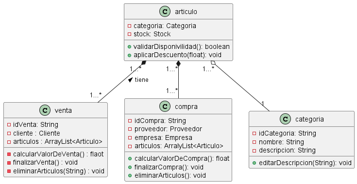

# MEITOR

## Iniciar Base De Datos de Archivos .txt
- Ejacutar el archivo InitDataBase 

## Login
- Email: admin@gmail.com 
- Password: admin123

## GestionDeVentas Alexandra Rivero

### Articulo

 Extiende la clase Prenda e implementa Serializable y ArticuloInterface. Esta clase está diseñada para gestionar los detalles específicos de los artículos en venta, incluyendo su categoría y su asociación con el stock.

Atributos Principales:

categoria: Un objeto de la clase Categoria que clasifica al artículo.
stock: Una instancia de StockInterface que maneja la disponibilidad y el precio del artículo.
Constructores:

Un constructor sin argumentos.
Un constructor que inicializa id, nombre, stockInterface, categoria y image.
Métodos Importantes:

Métodos getters para categoria y stock.
validarDisponibilidad(): Verifica si el artículo está disponible en stock.
aplicarDescuento(float porciento): Aplica un descuento al precio del artículo.
Funcionalidad Adicional:

La clase facilita la gestión de artículos en el sistema, permitiendo un control detallado sobre su clasificación y disponibilidad.
Esta clase es esencial para la gestión de inventario y ventas en tu sistema, ofreciendo una estructura organizada para el manejo de artículos y su información relacionada.

### Categoria

Implementa Serializable y sirve para representar y gestionar categorías de artículos en el sistema. Cada categoría incluye un identificador único, un nombre y una descripción, además de una lista de artículos asociados a ella.

Atributos Principales:

idCategoria: Un String que representa el identificador único de la categoría.
nombre: Un String para el nombre de la categoría.
descripcion: Un String que proporciona una descripción detallada de la categoría.
articulos: Un ArrayList de ArticuloInterface que contiene los artículos pertenecientes a esta categoría.
Constructores:

Un constructor sin argumentos.
Un constructor que inicializa idCategoria, nombre y descripcion.
Métodos Importantes:

Métodos getters para idCategoria, nombre, descripcion y articulos.
editarDescripcion(String descripcion): Permite cambiar la descripción de la categoría.
Funcionalidad Adicional:

Facilita la organización y clasificación de artículos, mejorando la gestión de inventario y la experiencia de búsqueda para los usuarios.
Esta clase es crucial para la estructuración y organización del inventario de artículos en tu sistema, proporcionando una manera clara y eficiente de agrupar y describir los artículos según sus características y usos.

### Compra 

Implementa Serializable y CompraInterface, y se encarga de representar y gestionar las compras en el sistema. Esta clase administra detalles como el identificador de la compra, el proveedor, la empresa asociada y la lista de artículos incluidos en la compra.

Atributos Principales:

idCompra: Un int que representa el identificador único de la compra.
proveedor: Una instancia de Proveedor que representa al proveedor de los artículos.
empresa: Una instancia de EmpresaInterface que representa a la empresa compradora.
articulos: Un ArrayList de ArticuloInterface que contiene los artículos adquiridos en la compra.
Constructores:

Un constructor que acepta solo articulos.
Un constructor que inicializa idCompra y articulos.
Métodos Importantes:

Métodos getters y setters para idCompra, proveedor, empresa y articulos.
calcularValorDeCompra(): Calcula el costo total de la compra.
finalizarCompra(): Limpia la lista de artículos, finalizando la compra.
eliminarArticulo(String id): Elimina un artículo específico de la compra.
Funcionalidad Adicional:

Facilita el proceso de compra, desde la selección de artículos hasta el cálculo del valor total y la finalización de la transacción.
Esta clase es clave en la gestión de compras dentro de tu sistema, asegurando una administración eficiente y detallada de cada transacción de compra.

### Venta 

 Implementa Serializable y VentaInterface, y se encarga de representar y gestionar las ventas en el sistema. Esta clase administra detalles como el identificador de la venta, el cliente asociado y la lista de artículos vendidos.

Atributos Principales:

idVenta: Un String que representa el identificador único de la venta.
cliente: Una instancia de Cliente que representa al cliente en la venta.
articulos: Un ArrayList de ArticuloInterface que contiene los artículos incluidos en la venta.
Constructores:

Un constructor sin argumentos.
Un constructor que inicializa idVenta.
Métodos Importantes:

Métodos getters y setters para idVenta, cliente y articulos.
calcularValorDeVenta(): Calcula el costo total de los artículos en la venta.
finalizarVenta(): Limpia la lista de artículos, finalizando la transacción.
eliminarArticulo(String id): Elimina un artículo específico de la venta.
Funcionalidad Adicional:

Facilita el proceso de venta, desde la selección de artículos hasta el cálculo del valor total y la finalización de la transacción.
Esta clase es esencial en la gestión de ventas dentro de tu sistema, asegurando una administración eficiente y detallada de cada transacción de venta.

