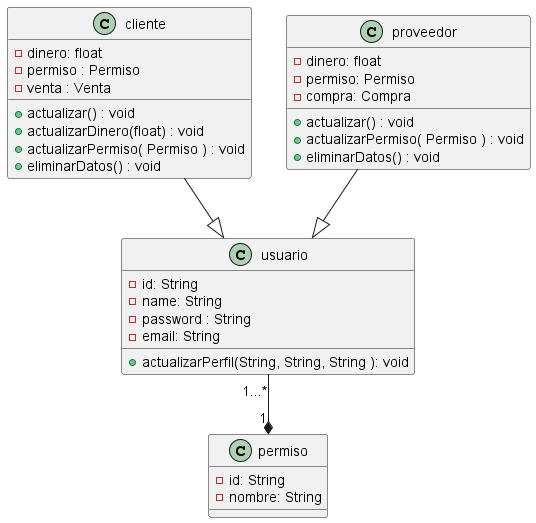

# MEITOR

## Iniciar Base De Datos de Archivos .txt
- Ejacutar el archivo InitDataBase 

## Login
- Email: admin@gmail.com 
- Password: admin123

## Login Daniela Rodriguez

### Cliente

Esta clase extiende la funcionalidad de la clase Usuario e implementa la interfaz Serializable. Está diseñada para gestionar la información relacionada con los clientes en el sistema, incluyendo su identificación, nombre, correo electrónico, contraseña, dinero disponible, permisos y ventas asociadas.

Atributos Principales:

dinero: Un float que representa la cantidad de dinero del cliente.
permiso: Una instancia de PermisoInterface que maneja los permisos del cliente.
venta: Una instancia de VentaInterface asociada al cliente.
Constructores:

Un constructor sin argumentos.
Un constructor que inicializa todos los atributos del cliente, incluyendo los heredados de Usuario.
Métodos Importantes:

actualizar(): Actualiza la información del cliente en la base de datos.
actualizarDinero(float dinero): Actualiza la cantidad de dinero del cliente.
actualizarPermiso(PermisoInterface permiso): Actualiza los permisos del cliente.
setVenta(VentaInterface venta): Asigna una venta al cliente.
elimiarDatos(): Elimina la información del cliente de la base de datos.
Funcionalidad Adicional:

La clase incluye métodos getters y setters para manejar los atributos del cliente.
Implementa la serialización para facilitar el almacenamiento y recuperación de los datos del cliente.
Esta clase es esencial para la gestión de clientes en el sistema, permitiendo un control detallado sobre sus atributos y la interacción con otros componentes del sistema como la gestión de ventas y permisos

### Permiso

 La clase Permiso implementa la interfaz PermisoInterface y la interfaz Serializable, permitiendo la representación y manejo de los permisos de los usuarios en el sistema. Esta clase es fundamental para definir y controlar los accesos y funcionalidades que cada usuario puede tener.

Atributos Principales:

id: Un String que representa el identificador único del permiso.
nombre: Un String que describe el nombre o la naturaleza del permiso.
Constructor:

Un constructor que inicializa el id y el nombre del permiso.
Métodos Importantes:

getId(): Devuelve el identificador del permiso.
getNombre(): Devuelve el nombre del permiso.
Funcionalidad Adicional:

La clase incluye métodos getters y setters para el manejo de sus atributos.
Esta clase es crucial para el sistema de control de accesos y permisos dentro de tu aplicación, permitiendo una gestión detallada y flexible de las capacidades y restricciones asignadas a los diferentes usuarios.

### Proveedor

Extiende la clase Usuario e implementa Serializable, enfocada en representar y manejar los datos de los proveedores en el sistema. Maneja atributos como identificación, nombre, correo electrónico, contraseña, dinero, permisos y compras asociadas.

Atributos Principales:

dinero: Un float que indica la cantidad de dinero asociada al proveedor.
permiso: Una instancia de PermisoInterface que define los permisos del proveedor.
compra: Una instancia de CompraInterface relacionada con el proveedor.
Constructores:

Un constructor sin argumentos.
Un constructor que inicializa todos los atributos del proveedor, incluyendo los heredados de Usuario.
Métodos Importantes:

actualizar(): Actualiza la información del proveedor en la base de datos.
setDinero(float dinero): Establece la cantidad de dinero del proveedor.
actualizarPermiso(PermisoInterface permiso): Actualiza los permisos del proveedor.
setCompra(CompraInterface compra): Asigna una compra al proveedor.
elimiarDatos(): Elimina la información del proveedor de la base de datos.
Funcionalidad Adicional:

Incluye métodos getters y setters para el manejo de atributos del proveedor.
Implementa la serialización para facilitar el almacenamiento y recuperación de datos del proveedor.
Esta clase es clave en la gestión de proveedores dentro de tu sistema, proporcionando un control detallado sobre sus finanzas, permisos y transacciones comerciales.

### Usuario

Implementa la interfaz Serializable y sirve como clase base para definir los usuarios en el sistema. Esta clase se encarga de gestionar la información esencial de los usuarios, como su identificación, nombre, correo electrónico y contraseña.

Atributos Principales:

id: Un String que representa el identificador único del usuario.
name: Un String que indica el nombre del usuario.
email: Un String para el correo electrónico del usuario.
password: Un String que guarda la contraseña del usuario.
Constructores:

Un constructor sin argumentos.
Un constructor que inicializa los atributos id, name, email y password.
Métodos Importantes:

Métodos getters y setters para cada uno de los atributos.
actualizarPerfil(String name, String email, String password): Permite actualizar la información del perfil del usuario.
Funcionalidad Adicional:

Provee una estructura básica y extensible para otros tipos de usuarios en el sistema, como Cliente y Proveedor.
La clase Usuario es la piedra angular para la gestión de usuarios en tu aplicación, proporcionando un marco común para la representación de diferentes tipos de usuarios y sus datos básicos.

