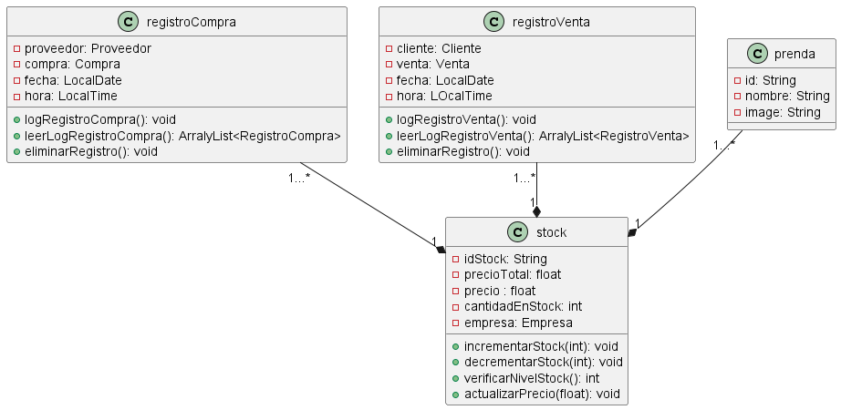

# MEITOR

## Iniciar Base De Datos de Archivos .txt
- Ejacutar el archivo InitDataBase 

## Login
- Email: admin@gmail.com 
- Password: admin123

## Almacen Marian Betancourt

### RegistroCompra 

 Implementa la interfaz Serializable y se utiliza para registrar las compras realizadas en el sistema. Gestiona detalles como el proveedor, la compra en sí, la fecha y hora del registro.

Atributos Principales:

proveedor: Una instancia de Proveedor que representa al proveedor en la transacción.
compra: Una instancia de CompraInterface que representa la compra realizada.
fecha: Un objeto LocalDate que registra la fecha de la compra.
hora: Un objeto LocalTime que registra la hora de la compra.
Constructores:

Un constructor sin argumentos.
Un constructor que inicializa proveedor, compraInterface, fecha y hora.
Métodos Importantes:

Métodos getters y setters para proveedor, compra, fecha y hora.
logRegistroCompra(): Registra la compra en un log.
leerLogRegistroCompra(): Lee el log de compras registradas.
eliminarRegistro(): Elimina todos los registros del log.
Funcionalidad Adicional:

Facilita el seguimiento y la administración de las compras, permitiendo un control detallado sobre cada transacción.
Esta clase es esencial para el manejo y seguimiento de las compras en tu sistema, ofreciendo una manera organizada y eficiente de documentar y acceder a los detalles de cada transacción.

### RegistroVenta

 Implementa la interfaz Serializable y se utiliza para llevar un registro de las ventas realizadas en el sistema. Esta clase gestiona detalles como el cliente, la venta realizada, la fecha y la hora del registro.

Atributos Principales:

cliente: Una instancia de Cliente que representa al cliente involucrado en la venta.
venta: Una instancia de VentaInterface que representa la venta realizada.
fecha: Un objeto LocalDate que registra la fecha de la venta.
hora: Un objeto LocalTime que registra la hora de la venta.
Constructores:

Un constructor sin argumentos.
Un constructor que inicializa cliente, ventaInterface, fecha y hora.
Métodos Importantes:

Métodos getters y setters para cliente, venta, fecha y hora.
logRegistroVenta(): Añade un nuevo registro de venta al log.
leerLogRegistroVenta(): Lee el log de ventas registradas.
eliminarRegistro(): Elimina todos los registros del log.
Funcionalidad Adicional:

Facilita el seguimiento y la administración de las ventas, permitiendo un control detallado sobre cada transacción.
Esta clase es esencial para el manejo y seguimiento de las ventas en tu sistema, ofreciendo una manera organizada y eficiente de documentar y acceder a los detalles de cada transacción de venta.

### Prenda 

 Implementa la interfaz Serializable y sirve como una clase base para representar prendas de vestir. Esta clase gestiona la información básica de cada prenda, incluyendo su identificador, nombre e imagen asociada.

Atributos Principales:

id: Un String que actúa como un identificador único para la prenda.
nombre: Un String que representa el nombre de la prenda.
image: Un String que almacena el enlace o la referencia a la imagen de la prenda.
Constructores:

Un constructor sin argumentos.
Un constructor que inicializa id, nombre e image.
Métodos Importantes:

Métodos getters y setters para id, nombre e image.
Funcionalidad Adicional:

Proporciona una estructura básica para representar diferentes tipos de prendas en el sistema, facilitando su identificación y visualización.
Esta clase es fundamental para gestionar la información de las prendas en tu sistema, ofreciendo una manera clara y estructurada de organizar y presentar los artículos de vestimenta.

### Stock

Implementa Serializable y StockInterface, y se utiliza para gestionar el stock de artículos en el sistema. Esta clase administra detalles como el identificador de stock, el precio total, la cantidad en stock, la asociación con una empresa y la lista de artículos.

Atributos Principales:

idStock: Un String que representa el identificador único del stock.
precio: Un float que indica el precio unitario de los artículos.
cantidadEnStock: Un int que representa la cantidad total de artículos disponibles.
empresaInterface: Una instancia de EmpresaInterface asociada al stock.
articulos: Un ArrayList de ArticuloInterface que contiene los artículos en stock.
Constructores:

Un constructor sin argumentos.
Constructores que inicializan precio, cantidadEnStock y opcionalmente articulos.
Métodos Importantes:

Métodos getters y setters para idStock, precio, cantidadEnStock, empresaInterface y articulos.
incrementarStock(int stock): Aumenta la cantidad en stock.
decrementarStock(int stock): Disminuye la cantidad en stock.
verificarNivelStock(): Retorna la cantidad actual en stock.
actualizarPrecio(float precio): Actualiza el precio unitario de los artículos.
Funcionalidad Adicional:

Facilita la gestión eficiente del inventario, permitiendo un seguimiento detallado de los artículos disponibles y sus precios.
Esta clase es fundamental para el manejo del inventario en tu sistema, proporcionando una manera organizada y efectiva de controlar y actualizar la información relacionada con los artículos en stock.

